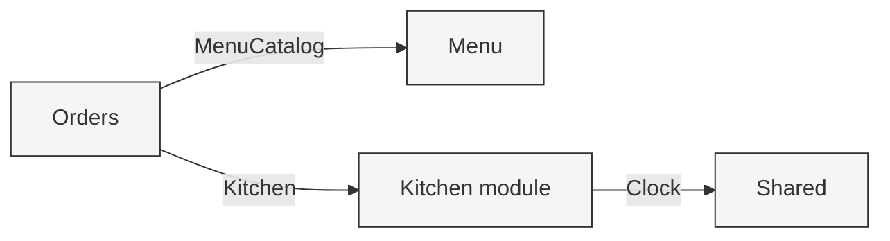
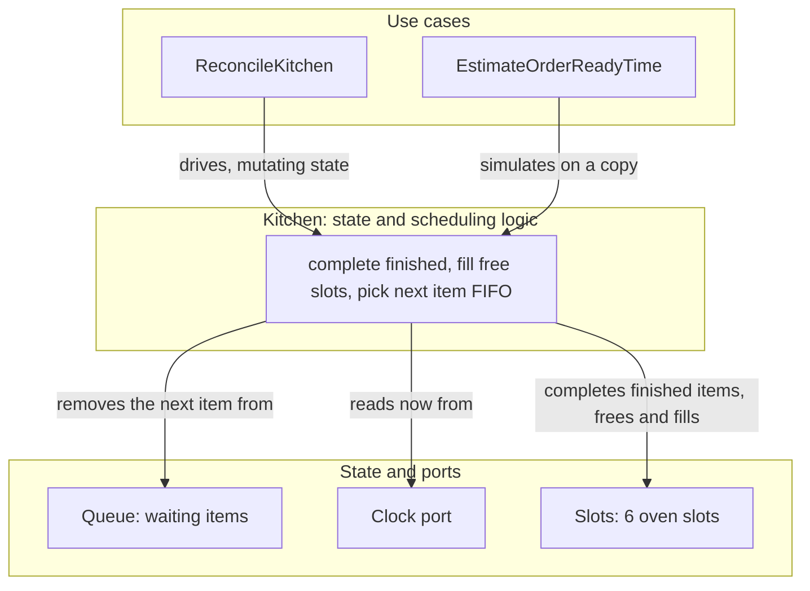
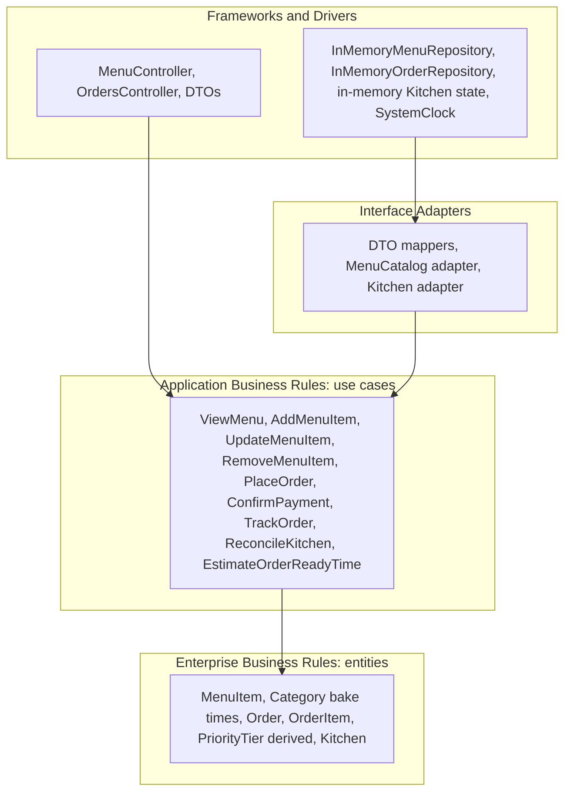

# Module Map and Dependencies

NestJS module boundaries and the direction dependencies point. Each module follows clean architecture internally: presentation depends on application, application depends on domain, and infrastructure implements the application's ports. The domain depends on nothing.

When a module needs something from another module, the consumer defines a single port describing exactly what it needs, and the providing module supplies an adapter. The boundary exists for a concrete reason: it keeps the consuming use cases unit-testable with a small fake. It is not dependency inversion for its own sake, and each provider exposes at most one port to its consumer.

## Modules

### SharedModule (core)

- `Clock` port and `SystemClock` implementation
- Common error and result types

Provides the `Clock` port consumed by the kitchen.

### MenuModule

- Domain: `MenuItem`, `Category`
- Application: `ViewMenu`, `AddMenuItem`, `UpdateMenuItem`, `RemoveMenuItem`; owns the `MenuRepository` port
- Infrastructure: `InMemoryMenuRepository` (implements `MenuRepository`)
- Presentation: `MenuController` and DTOs

Provides an adapter implementing Orders' `MenuCatalog` port.

### OrdersModule

- Domain: `Order`, `OrderItem`, `OrderSource`, `OrderStatus` (priority tier is derived from source, not a stored field)
- Application: `PlaceOrder`, `ConfirmPayment`, `TrackOrder`; owns the `OrderRepository`, `MenuCatalog`, and `Kitchen` ports
- Infrastructure: `InMemoryOrderRepository` (implements `OrderRepository`)
- Presentation: `OrdersController` and DTOs

The only cross-module consumer. No module depends on Orders.

### KitchenModule

- Domain: `Kitchen` (the 6 slots and the waiting queue, plus the scheduling logic over them) and `BakingItem`
- Application: `ReconcileKitchen`, `EstimateOrderReadyTime`; consumes the `Clock` port
- Infrastructure: in-memory kitchen state held as a single instance

Provides the adapter implementing Orders' `Kitchen` port.

#### Why the scheduler is not its own module

The kitchen has two responsibilities: tracking oven capacity (which slots are occupied and when they free) and scheduling (the queue and the choice of what bakes next). They are kept in one `Kitchen` type because scheduling has to read slot availability to place items; a module boundary between them would create a chatty port for no benefit at this stage.

The ordering rule is FIFO and lives in a single place inside `Kitchen`. We do not introduce a `SchedulingPolicy` Strategy yet, because it would have one implementation. That abstraction is introduced in the same iteration that adds priority ordering (feature 5), where the second implementation makes it earn its place. The single FIFO method is the seam: extracting the Strategy later is a localized change, not a rewrite.

## Ports

| Port | Defined by | Implemented by | Purpose |
|------|------------|----------------|---------|
| `MenuRepository` | Menu | Menu infrastructure | Persist and read menu items |
| `OrderRepository` | Orders | Orders infrastructure | Persist and read orders |
| `MenuCatalog` | Orders | Menu (adapter) | Look up menu items and prices when placing an order |
| `Kitchen` | Orders | Kitchen (adapter) | Enqueue a confirmed order's items and estimate an order's ready time |
| `Clock` | Shared | Shared (`SystemClock`) | Provide the current time to the kitchen |

## Dependency direction

```
Inside each module:
  Presentation  ->  Application  ->  Domain
  Infrastructure -> Application ports (implements them)
  Domain depends on nothing

Across modules (the consumer defines the port):
  Orders  -- MenuCatalog --> Menu     (Menu provides the adapter)
  Orders  -- Kitchen -->      Kitchen  (Kitchen provides the adapter)
  Kitchen -- Clock -->        Shared   (Shared provides SystemClock)

No cycles. Menu and Kitchen never depend on Orders.
```

## Visual: cross-module dependencies

Each edge is a port defined by the consumer and implemented by the provider's adapter.



## Visual: inside the Kitchen module

Both use cases delegate to the one `Kitchen` type, so the scheduling logic lives in a single place. `Kitchen` owns the slots and the queue and decides the next item to bake (FIFO for now, in one method). `ReconcileKitchen` runs this for real and changes state. `EstimateOrderReadyTime` runs the same steps on a copy and changes nothing, which is why an estimate can never drift from real scheduling.



### What the two use cases do

The kitchen is poll-based, so nothing moves on its own. `ReconcileKitchen` advances it to the current moment (complete finished items, then fill free slots from the queue, never preempting), and `EstimateOrderReadyTime` answers "when will this order be ready?" by running the same steps on a copy without changing anything.

Full step-by-step courses are in [functional-requirements.md](functional-requirements.md); the poll-based rationale is in [architecture-decisions.md](architecture-decisions.md); the inputs and outputs are in [contracts.md](contracts.md).

## Visual: clean architecture layers, with this project's types

Dependencies point inward. Nothing inner knows anything outer. The boxes name the actual components in this project, not generic layer labels.



