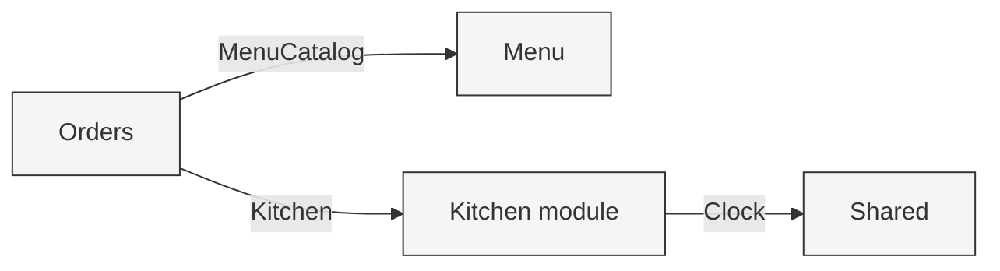

# Module Map and Dependencies

NestJS module boundaries and the direction dependencies point. Each module follows clean architecture internally: presentation depends on application, application depends on domain, and infrastructure implements the application's ports. The domain depends on nothing.

When a module needs something from another module, the consumer defines a single port describing exactly what it needs, and the providing module supplies an adapter. The boundary exists for a concrete reason: it keeps the consuming use cases unit-testable with a small fake. It is not dependency inversion for its own sake, and each provider exposes at most one port to its consumer.

## Modules

### SharedModule (core)

- `Clock` port and `SystemClock` implementation
- Common error and result types

Provides the `Clock` port consumed by the kitchen.

### MenuModule

- Domain: `MenuItem`, `Category`
- Application: `ViewMenu`, `AddMenuItem`, `UpdateMenuItem`, `RemoveMenuItem`; owns the `MenuRepository` port
- Infrastructure: `InMemoryMenuRepository` (implements `MenuRepository`)
- Presentation: `MenuController` and DTOs

Provides an adapter implementing Orders' `MenuCatalog` port.

### OrdersModule

- Domain: `Order`, `OrderItem`, `OrderSource`, `OrderStatus` (priority tier is derived from source, not a stored field)
- Application: `PlaceOrder`, `ConfirmPayment`, `TrackOrder`, `ReconcileOrders`; owns the `OrderRepository`, `MenuCatalog`, and `Kitchen` ports
- Infrastructure: `InMemoryOrderRepository` (implements `OrderRepository`)
- Presentation: `OrdersController` and DTOs

The only cross-module consumer. No module depends on Orders.

### KitchenModule

- Domain: `Kitchen` (the 6 slots and the waiting queue, plus the scheduling logic over them) and `BakingItem`
- Application: `MonitorKitchen`; consumes the `Clock` port
- Infrastructure: in-memory kitchen state held as a single instance

Provides the adapter implementing Orders' `Kitchen` port.

#### Why the scheduler is not its own module

The kitchen has two responsibilities: tracking oven capacity (which slots are occupied and when they free) and scheduling (the queue and the choice of what bakes next). They are kept in one `Kitchen` type because scheduling has to read slot availability to place items; a module boundary between them would create a chatty port for no benefit at this stage.

The ordering rule lives behind a `SchedulingPolicy` Strategy that `Kitchen` consumes. It has two implementations: `FifoPolicy` (arrival order) and `PriorityPolicy` (highest tier first, arrival order within a tier). The abstraction was deferred until priority ordering (feature 5) arrived and gave it a second implementation, so it earns its place rather than being speculative. Both `reconcile` and the estimate order the waiting queue through the policy, so a prediction can never diverge from real scheduling. No preemption lives in `Kitchen` itself: the policy only orders the waiting queue, never what is already baking.

## Ports

| Port | Defined by | Implemented by | Purpose |
|------|------------|----------------|---------|
| `MenuRepository` | Menu | Menu infrastructure | Persist and read menu items |
| `OrderRepository` | Orders | Orders infrastructure | Persist and read orders |
| `MenuCatalog` | Orders | Menu (adapter) | Look up menu items and prices when placing an order |
| `Kitchen` | Orders | Kitchen (adapter) | Enqueue a confirmed order's items and estimate an order's ready time |
| `Clock` | Shared | Shared (`SystemClock`) | Provide the current time to the kitchen |

## Dependency direction

```
Inside each module:
  Presentation  ->  Application  ->  Domain
  Infrastructure -> Application ports (implements them)
  Domain depends on nothing

Across modules (the consumer defines the port):
  Orders  -- MenuCatalog --> Menu     (Menu provides the adapter)
  Orders  -- Kitchen -->      Kitchen  (Kitchen provides the adapter)
  Kitchen -- Clock -->        Shared   (Shared provides SystemClock)

No cycles. Menu and Kitchen never depend on Orders.
```

## Visual: cross-module dependencies

Each edge is a port defined by the consumer and implemented by the provider's adapter.



## Visual: inside the Kitchen module

`MonitorKitchen` reads the current kitchen state via the `Clock` port and returns a view of the two ovens and the waiting queue. The `Kitchen` domain type does all the scheduling work; `MonitorKitchen` only reads it.

Reconciliation and estimation are not kitchen use cases. `ReconcileOrders` (in the Orders module) owns reconciliation: it calls the `Kitchen` port's `readyTimes()` to derive live finish times and advances orders from `InKitchen` to `Ready`. Estimation is done inside `ConfirmPayment` via `enqueueAndEstimate`, which enqueues and estimates atomically so two simultaneous confirmations cannot both estimate before either enqueues.

Full step-by-step courses are in [functional-requirements.md](functional-requirements.md); the poll-based rationale is in [architecture-decisions.md](architecture-decisions.md); the inputs and outputs are in [contracts.md](contracts.md).

## Visual: clean architecture layers, with this project's types

Dependencies point inward. Nothing inner knows anything outer. The boxes name the actual components in this project, not generic layer labels.


