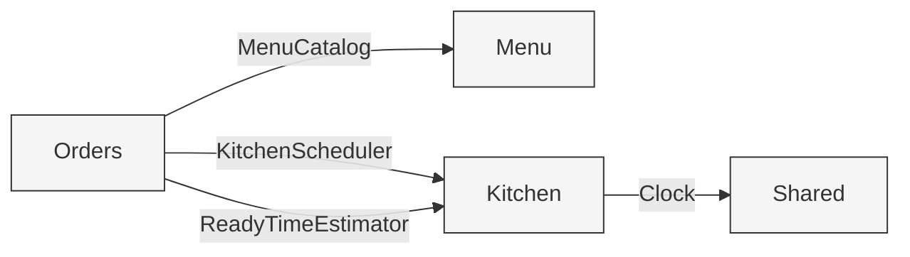
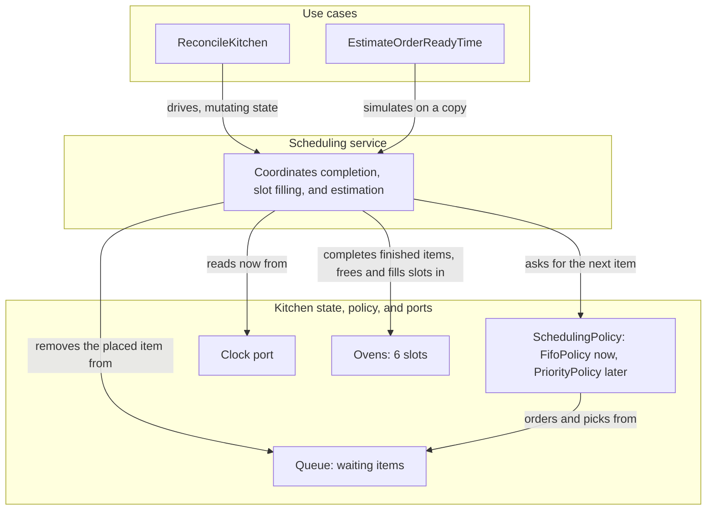
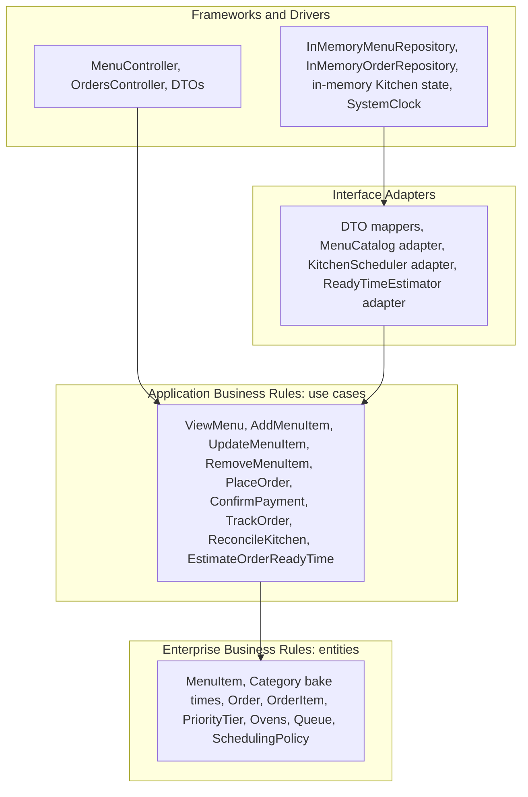

# Module Map and Dependencies

NestJS module boundaries and the direction dependencies point. Each module follows clean architecture internally: presentation depends on application, application depends on domain, and infrastructure implements the application's ports. The domain depends on nothing.

Cross-module dependencies are consumer-owned: when a module needs something from another module, it defines the port (interface) describing exactly what it needs, and the providing module supplies an adapter that implements it. This keeps the dependency inverted: the consumer owns the contract, not the provider.

## Modules

### SharedModule (core)

- `Clock` port and `SystemClock` implementation
- Common error and result types

Provides the `Clock` port consumed by the kitchen.

### MenuModule

- Domain: `MenuItem`, `Category`
- Application: `ViewMenu`, `AddMenuItem`, `UpdateMenuItem`, `RemoveMenuItem`; owns the `MenuRepository` port
- Infrastructure: `InMemoryMenuRepository` (implements `MenuRepository`)
- Presentation: `MenuController` and DTOs

Provides an adapter implementing Orders' `MenuCatalog` port.

### OrdersModule

- Domain: `Order`, `OrderItem`, `OrderSource`, `PriorityTier`, `OrderStatus`
- Application: `PlaceOrder`, `ConfirmPayment`, `TrackOrder`; owns the `OrderRepository`, `MenuCatalog`, `KitchenScheduler`, and `ReadyTimeEstimator` ports
- Infrastructure: `InMemoryOrderRepository` (implements `OrderRepository`)
- Presentation: `OrdersController` and DTOs

The only cross-module consumer. No module depends on Orders.

### KitchenModule

- Domain: `Ovens` (the 6 slots and their `BakingItem`s), `Queue` (the waiting line), and `SchedulingPolicy` (a Strategy that orders the queue; `FifoPolicy` for now)
- Application: `ReconcileKitchen`, `EstimateOrderReadyTime`; consumes the `Clock` port
- Infrastructure: in-memory kitchen state held as a single instance

Provides adapters implementing Orders' `KitchenScheduler` and `ReadyTimeEstimator` ports.

#### Why the scheduler is not its own module

The kitchen has two distinct responsibilities: tracking oven capacity (which slots are occupied and when they free) and scheduling (the queue plus the policy that decides what bakes next). They change for different reasons. Capacity is fixed by the challenge; the scheduling policy is the part that evolves, from FIFO now to priority and the VIP ripple later. That policy is the core of the challenge.

We keep both inside a single Kitchen module rather than splitting the scheduler into its own module, because the scheduler must read slot availability to place items. A module boundary between them would create a chatty port for no benefit at this stage. Instead, the responsibilities are made explicit inside the one module: `Ovens`, `Queue`, and a swappable `SchedulingPolicy`.

This keeps the most important and most-likely-to-change concept (the ordering policy) isolated behind a Strategy. Moving from FIFO to priority becomes a strategy swap, not a rewrite, and not a new module. If the scheduler later grows its own persistence or scaling needs, it can be extracted into a dedicated module at that point. Until then, splitting it would be premature.

## Consumer-owned ports

| Port | Owned by | Implemented by | Purpose |
|------|----------|----------------|---------|
| `MenuRepository` | Menu | Menu infrastructure | Persist and read menu items |
| `OrderRepository` | Orders | Orders infrastructure | Persist and read orders |
| `MenuCatalog` | Orders | Menu (adapter) | Look up menu items and prices when placing an order |
| `KitchenScheduler` | Orders | Kitchen (adapter) | Enqueue a confirmed order's items |
| `ReadyTimeEstimator` | Orders | Kitchen (adapter) | Estimate an order's ready time |
| `Clock` | Shared | Shared (`SystemClock`) | Provide the current time to the kitchen |

## Dependency direction

```
Inside each module:
  Presentation  ->  Application  ->  Domain
  Infrastructure -> Application ports (implements them)
  Domain depends on nothing

Across modules (consumer owns the contract):
  Orders  -- MenuCatalog -->        Menu     (Menu provides the adapter)
  Orders  -- KitchenScheduler -->   Kitchen  (Kitchen provides the adapter)
  Orders  -- ReadyTimeEstimator --> Kitchen  (Kitchen provides the adapter)
  Kitchen -- Clock -->              Shared   (Shared provides SystemClock)

No cycles. Menu and Kitchen never depend on Orders.
```

## Visual: cross-module dependencies

Each edge is a consumer-owned port. The arrow points from the consumer that owns the contract to the provider that supplies the adapter.



## Visual: inside the Kitchen module

Both use cases delegate to one scheduling service, so the scheduling logic lives in a single place. The service coordinates four collaborators. The policy is a Strategy, swappable from FIFO to priority without touching the ovens or the queue mechanics.

`ReconcileKitchen` runs this for real and changes state. `EstimateOrderReadyTime` runs the same steps on a copy and changes nothing, which is why an estimate can never drift from real scheduling.



### What the two use cases do

The kitchen is poll-based: it has no timers, so nothing moves on its own. The two use cases are how it advances and how it is read.

`ReconcileKitchen` brings the kitchen up to the current moment. It does two things in order: first it completes every baking item whose bake time has elapsed and frees its slot (and marks an order ready once its last item finishes), then it fills each free slot from the queue, asking the `SchedulingPolicy` which waiting item is next. It never preempts an item that is already baking. It runs whenever current truth is needed, for example when an order is confirmed or tracked.

`EstimateOrderReadyTime` answers "when will this order be ready?" by running the same scheduling steps on a copy of the ovens and queue, fast-forwarding the clock until the order's last item finishes. It changes nothing. Sharing one algorithm with `ReconcileKitchen` is what keeps an estimate from ever drifting from how the kitchen actually behaves.

For the full step-by-step courses (including the edge cases), see the use case definitions in [functional-requirements.md](functional-requirements.md). For why the kitchen is poll-based rather than timer-based, see [architecture-decisions.md](architecture-decisions.md). For the data each operation accepts and returns, see [contracts.md](contracts.md).

## Visual: clean architecture layers, with this project's types

Dependencies point inward. Nothing inner knows anything outer. The boxes name the actual components in this project, not generic layer labels.



