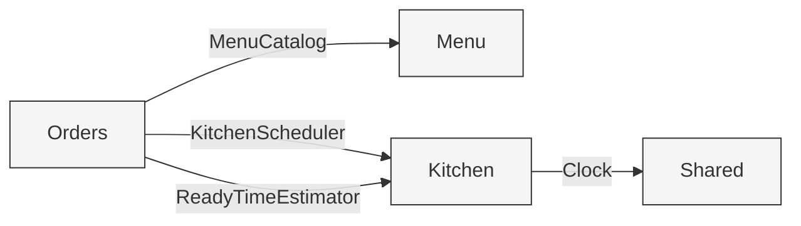
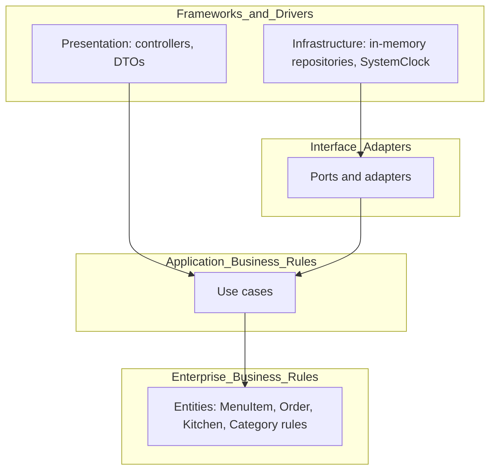

# Module Map and Dependencies

NestJS module boundaries and the direction dependencies point. Each module follows clean architecture internally: presentation depends on application, application depends on domain, and infrastructure implements the application's ports. The domain depends on nothing.

Cross-module dependencies are consumer-owned: when a module needs something from another module, it defines the port (interface) describing exactly what it needs, and the providing module supplies an adapter that implements it. This keeps the dependency inverted: the consumer owns the contract, not the provider.

## Modules

### SharedModule (core)

- `Clock` port and `SystemClock` implementation
- Common error and result types

Provides the `Clock` port consumed by the kitchen.

### MenuModule

- Domain: `MenuItem`, `Category`
- Application: `ViewMenu`, `AddMenuItem`, `UpdateMenuItem`, `RemoveMenuItem`; owns the `MenuRepository` port
- Infrastructure: `InMemoryMenuRepository` (implements `MenuRepository`)
- Presentation: `MenuController` and DTOs

Provides an adapter implementing Orders' `MenuCatalog` port.

### OrdersModule

- Domain: `Order`, `OrderItem`, `OrderSource`, `PriorityTier`, `OrderStatus`
- Application: `PlaceOrder`, `ConfirmPayment`, `TrackOrder`; owns the `OrderRepository`, `MenuCatalog`, `KitchenScheduler`, and `ReadyTimeEstimator` ports
- Infrastructure: `InMemoryOrderRepository` (implements `OrderRepository`)
- Presentation: `OrdersController` and DTOs

The only cross-module consumer. No module depends on Orders.

### KitchenModule

- Domain: `Kitchen`, `BakingItem`, `Slot`, queue
- Application: `ReconcileKitchen`, `EstimateOrderReadyTime`; consumes the `Clock` port
- Infrastructure: in-memory kitchen state held as a single instance

Provides adapters implementing Orders' `KitchenScheduler` and `ReadyTimeEstimator` ports.

## Consumer-owned ports

| Port | Owned by | Implemented by | Purpose |
|------|----------|----------------|---------|
| `MenuRepository` | Menu | Menu infrastructure | Persist and read menu items |
| `OrderRepository` | Orders | Orders infrastructure | Persist and read orders |
| `MenuCatalog` | Orders | Menu (adapter) | Look up menu items and prices when placing an order |
| `KitchenScheduler` | Orders | Kitchen (adapter) | Enqueue a confirmed order's items |
| `ReadyTimeEstimator` | Orders | Kitchen (adapter) | Estimate an order's ready time |
| `Clock` | Shared | Shared (`SystemClock`) | Provide the current time to the kitchen |

## Dependency direction

```
Inside each module:
  Presentation  ->  Application  ->  Domain
  Infrastructure -> Application ports (implements them)
  Domain depends on nothing

Across modules (consumer owns the contract):
  Orders  -- MenuCatalog -->        Menu     (Menu provides the adapter)
  Orders  -- KitchenScheduler -->   Kitchen  (Kitchen provides the adapter)
  Orders  -- ReadyTimeEstimator --> Kitchen  (Kitchen provides the adapter)
  Kitchen -- Clock -->              Shared   (Shared provides SystemClock)

No cycles. Menu and Kitchen never depend on Orders.
```

## Visual: cross-module dependencies

Each edge is a consumer-owned port. The arrow points from the consumer that owns the contract to the provider that supplies the adapter.



## Visual: clean architecture layers within a module

Dependencies point inward. Nothing inner knows anything outer. Infrastructure and presentation sit on the outside; entities sit at the center.



